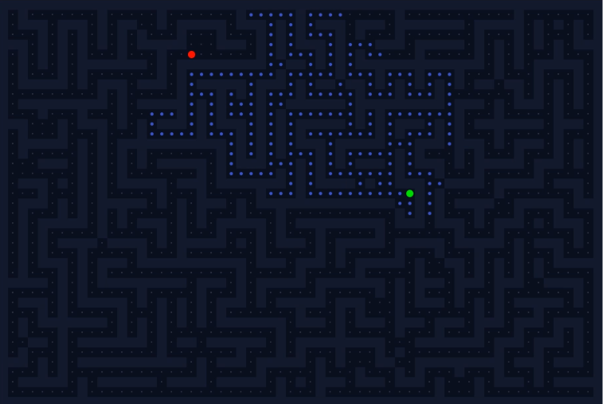

# A* Pathfinding Visualizer 🚀

A high-performance, real-time visualization of the **A* (A-Star) Pathfinding Algorithm** built in Java. This project demonstrates how the algorithm navigates complex, randomly generated mazes to find the shortest path between two points.



## ✨ Features
* **Recursive Backtracker Maze Generation:** Generates a unique, complex maze structure every time.
* **Real-Time Animation:** Visualizes the "search" process (Blue nodes) and the final path (Glowing Cyan).
* **Professional UI:** "Dark Mode" aesthetic with neon-style rendering and "pen dot" graphics.
* **Interactive:** Press **SPACE** to instantly generate a new maze with random Start/End points.
* **Optimized Performance:** Handles high-resolution grids (61x41) with smooth rendering using Java Swing.

## 📂 Source Files
This repository contains the following Java files:
1.  `MainVisualizer.java` - The entry point, window setup, and input handling.
2.  `AStarPathfinder.java` - Contains the core A* logic and step-by-step execution.
3.  `Node.java` - Represents each grid cell (state, costs, coordinates).

## 🚀 How to Run

### Prerequisites
* Java Development Kit (JDK 8 or higher) installed.

### Steps
1.  **Clone the repository** (or download the ZIP):
    ```bash
    git clone [https://github.com/rdChandrahaS/Fun_Projects-Astar_Node_Visualization.git](https://github.com/rdChandrahaS/Fun_Projects-Astar_Node_Visualization.git)
    cd Fun_Projects-Astar_Node_Visualization
    ```

2.  **Compile the source code**:
    ```bash
    javac MainVisualizer.java
    ```

3.  **Run the application**:
    ```bash
    java MainVisualizer
    ```

## 🎮 Controls

| Input | Function |
| :--- | :--- |
| <kbd>SPACE</kbd> | **Generate New Maze** (Randomizes Walls, Start & Goal) |

> **Note:** You can press <kbd>Space</kbd> at any time during the animation to instantly restart.

## 🛠️ Tech Stack
* **Language:** Java
* **GUI Framework:** Java Swing (Graphics2D)
* **Algorithms:** A* Search, Recursive Backtracker

## 📄 License
This project is open for educational use.
